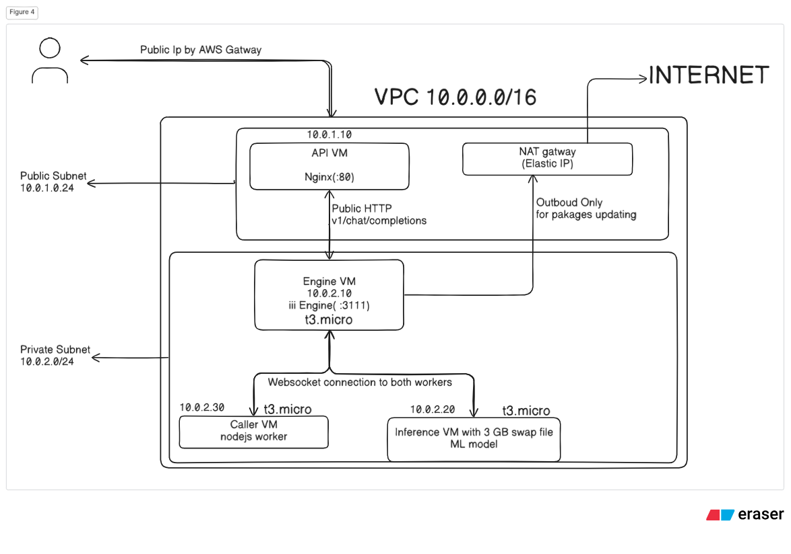
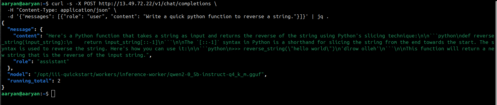

# Distributed SLM Inference Pipeline on AWS (VPC & RPC)

This repository contains the complete Infrastructure-as-Code (IaC) and deployment scripts to deploy a private, highly secure, and cost-optimized distributed Small Language Model (SLM) inference pipeline on AWS using the `iii` orchestration framework and `llama-cpp-python` (running a quantized Qwen2-0.5B model).

---

> [!IMPORTANT]
> **⚡ LIVE API ENDPOINT AVAILABLE (Valid until May 25, 2026)**
> You can test my live running deployment end-to-end right now without provisioning anything! 
> 
> Simply run this command from any terminal on your local machine:
> ```bash
> curl -s -X POST http://13.49.72.22/v1/chat/completions \
>   -H "Content-Type: application/json" \
>   -d '{"messages": [{"role": "user", "content": "What is 2 + 2?"}]}' | jq .
> ```
> *Note: To avoid ongoing AWS hosting charges, this live environment will be active until **May 25, 2026**, after which the resources will be permanently destroyed.*

---

## Architecture Overview

The architecture is designed with **network isolation** as a first-tier priority. All core execution VMs live inside a fully private subnet, isolated from the public internet. Only a hardened API reverse-proxy VM is exposed to the public.



### End-to-End Request Journey:
1. **Client Request:** A client sends an HTTP POST request to the **API VM's Public IP** on port `80`.
2. **Reverse Proxy:** Nginx on the API VM forwards the request privately to the **Engine VM** (`10.0.2.10:3111`) inside the private subnet.
3. **Engine Routing:** The `iii` Engine receives the request and routes the `http::run_inference` call over WebSocket to the **Caller VM** (`10.0.2.30`).
4. **Orchestration:** The Caller Worker triggers the private RPC function `inference::run_inference` back through the Engine.
5. **Inference Execution:** The Engine forwards the call to the **Inference VM** (`10.0.2.20`). The Python worker loads `Qwen2-0.5B-Instruct-Q4_K_M` via `llama-cpp-python` and performs CPU-based inference.
6. **State Tracking:** The engine increments a state-persisted `"running_total"` and bubbles the final response back to the client.

---

## Core Networking & Infrastructure Breakdown

To achieve complete network isolation, this architecture divides network routing and access controls into layered infrastructure concepts. Here is exactly how each component functions under the hood:

### 1. VPC & Subnet Segmentation
* **VPC (`10.0.0.0/16`):** The Virtual Private Cloud is our isolated cloud network chunk. The `/16` CIDR allows up to **65,536 private IP addresses** (`10.0.0.0` to `10.0.255.255`).
* **Public Subnet (`10.0.1.0/24`):** Sliced from the VPC, containing 256 IPs. VMs inside this subnet can be mapped to public-facing IPs. It contains the public API Gateway VM (`10.0.1.10`) and the NAT Gateway.
* **Private Subnet (`10.0.2.0/24`):** Also containing 256 IPs. All VMs in this subnet have **only private IPs**. They are completely invisible to the internet. This houses our core logic: Engine (`10.0.2.10`), Inference (`10.0.2.20`), and Caller (`10.0.2.30`).

### 2. Internet Gateway (IGW) vs. NAT Gateway
* **Internet Gateway (IGW):** AWS's two-way front door. When a user requests your public IP (`13.49.72.22`), the IGW converts that address into the private IP of the API VM (`10.0.1.10`) and vice-versa.
* **NAT Gateway:** A **one-way egress door** that sits in the public subnet and has a dedicated static public IP (Elastic IP). Private instances cannot receive traffic from the internet, but they can call *out* to the internet (to install libraries from `pip` or download weights from `Hugging Face`) by routing through the NAT Gateway. The NAT Gateway intercepts their outgoing packets, swaps the source IP with its own public IP, forwards it out the IGW, and routes the responses back.

### 3. Route Tables (How Traffic Knows Where to Go)
Route tables contain rules directing IP packets based on their destination:
* **Public Subnet Route Table:**
  * `10.0.0.0/16` ➔ `local`: Keep all internal VPC communications inside the network.
  * `0.0.0.0/0` (everywhere else) ➔ `IGW`: Send all internet traffic directly out the Internet Gateway.
* **Private Subnet Route Table:**
  * `10.0.0.0/16` ➔ `local`: Keep internal communications local.
  * `0.0.0.0/0` ➔ `NAT Gateway`: Send all outbound internet requests through the NAT Gateway.

### 4. Security Groups (Virtual Instance Firewalls)
Security groups are **stateful instance-level firewalls**. If you allow an inbound connection, the response is automatically permitted outwards without needing a separate outbound rule.
* **API Security Group:** Opens port `80` (HTTP) and port `22` (SSH) to the public. Blocks all other ports.
* **Private Security Group:** Blocks all public traffic entirely. Only permits inbound connections that originate **within the VPC (`10.0.0.0/16`)**. This allows the Engine, Caller, and Inference VMs to communicate securely on arbitrary ports.
* **Bastion-style SSH:** The private VMs only allow SSH connections that are proxied directly through the API VM.

### 5. Core Internal Orchestration (`iii` framework)
Instead of VMs making HTTP calls directly to one another (which creates fragile coupling), they communicate using a **Message Broker / RPC design** facilitated by the `iii` engine:
* **WebSocket-based connections:** When the Caller VM and Inference VM boot up, they establish a persistent WebSocket connection *outwards* to the central Engine VM on port `49134`.
* **State Persistence:** When the Caller or Inference workers need to save counters (such as `running_total`), they invoke the engine's built-in State Worker (KV store).
* **Decoupled RPC:** When Nginx hits the Engine VM, the engine knows which worker is currently connected over WebSockets that registers that specific function, dispatches the RPC payload to it, and receives the response. This allows us to scale up our workers dynamically without ever changing our network or firewall rules!

---

## Exact JSON API & Usage

### Endpoint
`POST http://<API_PUBLIC_IP>/v1/chat/completions`

### Exact Curl Command
```bash
curl -s -X POST http://<API_PUBLIC_IP>/v1/chat/completions \
  -H "Content-Type: application/json" \
  -d '{"messages": [{"role": "user", "content": "What is 2 + 2?"}]}' | jq .
```

### Sample Request Payload
```json
{
  "messages": [
    {
      "role": "user",
      "content": "What is 2 + 2?"
    }
  ]
}
```

### Sample Response Payload
```json
{
  "message": {
    "content": "The sum of 2 and 2 is 4.",
    "role": "assistant"
  },
  "model": "/opt/iii-quickstart/workers/inference-worker/qwen2-0_5b-instruct-q4_k_m.gguf",
  "running_total": 1
}
```
## Actual Response Screenshot


---

## 💡 The `t3.micro` Memory Challenge & The Swap Space Solution

One of the biggest challenges when deploying machine learning pipelines on cost-effective infrastructure is the initial installation phase. In this project, we successfully run the entire distributed inference cluster entirely on AWS **`t3.micro`** instances (which contain only **1 GB of physical RAM**). 

Here is exactly why we added the **3 GB Swap File**, and how it works under the hood:

### 1. The Bottleneck: Compiler RAM Spike
The quantized Qwen2-0.5B GGUF model is extremely lightweight:
* **Model Size:** `~380 MB`
* **Ubuntu Server Baseline Memory:** `~150 MB`
* **Total running memory:** `~600 MB` (Fits easily inside the 1GB RAM with 400MB of headroom!).

However, during deployment, the VM must install `llama-cpp-python` from source. Compiling large C++ libraries using the `g++` compiler requires substantial memory. **During compilation, memory usage spikes to ~1.7 GB - 2.0 GB**. On a standard `t3.micro` instance with only 1GB RAM, this instantly triggers a kernel Out-of-Memory (OOM) event, causing the compiler to crash or freezing the VM completely.

### 2. The Engineering Workaround: SSD Swap Space
To prevent expensive server upgrades, we modified the `inference.sh.tftpl` startup user-data script to dynamically allocate a **3 GB Swap File** on the instance's SSD (EBS volume) at first boot:

```bash
fallocate -l 3G /swapfile
chmod 600 /swapfile
mkswap /swapfile
swapon /swapfile
```

### 3. The Result: Native Performance + Free Tier Compatibility
* **During Installation:** The `g++` compiler uses the 1GB of physical RAM and seamlessly spills the excess 1GB of compiling data onto the SSD swap file. The compilation finishes successfully without freezing the instance.
* **During Execution:** Once compiled, the Qwen2 model runs entirely within the fast physical RAM (~600MB). It rarely touches the swap space, ensuring **full native CPU inference performance** at zero infrastructure cost!

---

## Step-by-Step Deployment Instructions

Deploying this stack is completely automated. It is designed to run efficiently on **`t3.micro`** instances, utilising an auto-configured **3GB swap file** on the inference node to safely compile C++ binaries without incurring expensive GPU or high-RAM AWS costs.

### Prerequisites & Local Setup Guide

Before deploying, ensure you have the required CLI tools installed on your local control machine. Follow the official installation guides below:

#### 1. AWS CLI (v2.x)
The AWS Command Line Interface allows you to authenticate and interact with your AWS cloud resources.
* **Official Download Guide:** [AWS CLI Installation Guide](https://docs.aws.amazon.com/cli/latest/userguide/getting-started-install.html)
* **Quick Install (Debian/Ubuntu):**
  ```bash
  curl "https://awscli.amazonaws.com/awscli-exe-linux-x86_64.zip" -o "awscliv2.zip"
  unzip awscliv2.zip
  sudo ./aws/install
  ```
* **Configuration:** Configure your credentials and default region:
  ```bash
  aws configure
  # Enter your AWS Access Key ID, Secret Access Key, and default region (e.g. eu-north-1)
  ```

#### 2. Terraform (v1.5.0+)
Terraform is used to define and provision the AWS network and VM infrastructure as code.
* **Official Download Guide:** [Terraform Installation Guide](https://developer.hashicorp.com/terraform/install)
* **Quick Install (Debian/Ubuntu):**
  ```bash
  sudo apt-get update && sudo apt-get install -y gnupg software-properties-common
  wget -O- https://apt.releases.hashicorp.com/gpg | gpg --dearmor | sudo tee /usr/share/keyrings/hashicorp-archive-keyring.gpg > /dev/null
  echo "deb [signed-by=/usr/share/keyrings/hashicorp-archive-keyring.gpg] https://apt.releases.hashicorp.com $(lsb_release -cs) main" | sudo tee /etc/apt/sources.list.d/hashicorp.list
  sudo apt-get update && sudo apt-get install terraform
  ```

#### 3. iii CLI (SDK & Orchestration Runtime)
The `iii` CLI is the control tool for managing the engine and workers locally or remotely.
* **Official Documentation:** [iii Quickstart Docs](https://iii.dev/docs/quickstart)
* **Quick Install (macOS/Linux):**
  ```bash
  curl -fsSL https://install.iii.dev/iii/main/install.sh | sh
  ```

#### 4. AWS EC2 Key Pair
An SSH Key Pair is required so Terraform can configure SSH access to your instances.
* Create a key pair named `quickstart-key` in your target AWS console region.
* Save the key locally as `quickstart-key.pem` and secure its permissions:
  ```bash
  chmod 400 quickstart-key.pem
  ```

### Step 1: Clone and Set Up Variables
```bash
git clone https://github.com/aaryan359/quickstart.git
cd quickstart/terraform
cp terraform.tfvars.example terraform.tfvars
```

Edit `terraform.tfvars` with your details:
```hcl
aws_region              = "eu-north-1"
availability_zone       = "eu-north-1a"
ssh_key_name            = "quickstart-key" # Your EC2 key pair name
my_ip_cidr              = "0.0.0.0/0"      # Restrict to your IP (e.g. 203.0.113.5/32)
project_name            = "iii-quickstart"
instance_type           = "t3.micro"
inference_instance_type = "t3.micro"       # Runs safely with our custom 3GB Swap!

repo_url                = "https://github.com/aaryan359/quickstart.git"
repo_ref                = "main"
```

### Step 2: Deploy Infrastructure
```bash
terraform init
terraform plan
terraform apply --auto-approve
```

*Note: Once Terraform finishes, the VMs will boot. The Inference VM will automatically partition a 3GB Swap file on its SSD to safely compile and build the C++ model server. This process takes about 10–12 minutes. You can monitor the progress by SSHing into the API VM and running `sudo tail -f /var/log/cloud-init-output.log` on the inference VM.*

### Step 3: Clean Up
To destroy all provisioned resources and prevent ongoing AWS charges:
```bash
terraform destroy --auto-approve
```

---

## Production Hardening Plan

Before moving this configuration to a production environment, the following security and reliability practices should be implemented:

1. **Zero-Trust Network Routing (Least Privilege SGs):** Currently, the private security group permits broad internal port ranges (`0-65535`) between VPC nodes. In production, restrict SGs to specific ports:
   * Only Nginx (API VM) should reach port `3111` on the Engine VM.
   * Only WebSocket connection ports (`49134`) should be open to the engine from Caller and Inference workers.
2. **Public Entry Point Hardening:** 
   * Replace the public API VM with an **AWS Application Load Balancer (ALB)** integrated with AWS WAF (Web Application Firewall) to protect against DDoS and layer-7 attacks.
   * Secure all public traffic using SSL/TLS via **AWS Certificate Manager (ACM)**.
3. **Host Hardening & SSM:** 
   * Disable port `22` (SSH) entirely.
   * Use **AWS Systems Manager (SSM) Session Manager** for secure console access to all VMs, removing the need for open SSH ports or SSH key files.
4. **State Storage Migration:** Move state persistence out of local flat files on the Engine VM to a managed, distributed database such as **AWS DynamoDB** or **Amazon ElastiCache (Redis)**.
5. **Secret Management:** Eliminate clear-text repo URLs and credentials from Terraform variables. Retrieve secrets dynamically during EC2 boot using **AWS Secrets Manager**.

---

## Scaling up 100x (To 50B+ Parameters)

If the model size scales 100x (e.g., to a 50B+ parameter model like Llama-3-70B), a CPU-only `t3.micro` architecture will be insufficient. The system must adapt using the following strategies:

1. **Dedicated GPU Architecture Basically Vertical Scaling:**
   * Transition the Inference VM from CPU (`t3.micro`) to high-throughput GPU instances, such as **`g5.12xlarge`** (4x NVIDIA A10G GPUs) or **`p4d`** (NVIDIA A100 GPUs).
2. **High-Performance Serving Engine basically Better Inference Server:**
   * Run the model server using frameworks built specifically for massive concurrent scaling, such as **vLLM** or **TGI (Text Generation Inference)**.
   * Utilise features like **PagedAttention** and **Continuous Batching** to maximise GPU compute utilization and reduce latency.
3. **Dynamic Autoscaling & Orchestration Basically Horizontal Scaling:**
   * Move from standalone EC2 instances to **Amazon EKS (Kubernetes)**.
   * Use **KEDA (Kubernetes Event-driven Autoscaling)** to dynamically scale GPU node groups up or down based on outstanding request counts in the `iii` queue.
4. **Streaming Responses Basically Live Speed:** Modify the JSON API and Caller worker to support **Server-Sent Events (SSE)**. This allows the model to stream tokens to users in real-time, dramatically improving the user experience and decreasing Time-To-First-Token (TTFT).
